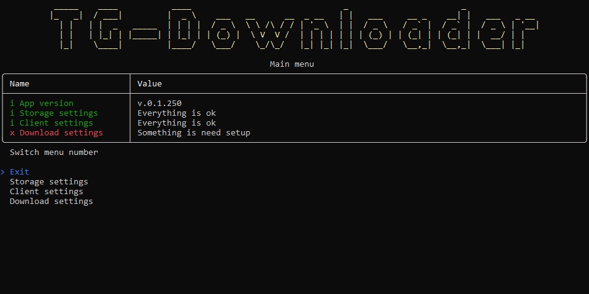

# TgDownloader - Загрузчик файлов Telegram

## 
<b><a href="README.md">English</a> | <a href="README-RUS.md">Русский</a></b>

## 

## Обзор
Скачайте файлы каналов или групп Telegram, в которых вы состоите.

## Требования к установке
- [Установите .NET 7.0](https://dotnet.microsoft.com/download/dotnet/7.0)
- [Зарегистрируйте Telegram приложение](https://my.telegram.org/apps/)
- Сохраните значения полей "App api_id" и "App api_hash"

## Быстрый старт
- Настройте локальное хранилище из TgDownloader
- Настройте Telegram клиент из TgDownloader
- Настройте скачивание из TgDownloader

## Статус

## Поддержка
Пожалуйста, нажмите на кнопку `звездочка`, если эта программа была вам полезна.

## Быстрые ссылки
- [История версий](CHANGELOG-RUS.md)
- [Лицензия](LICENSE.md)
- [Сообщить об ошибке](https://github.com/DamianMorozov/TgDownloader/issues)
- [Обсуждения](https://github.com/DamianMorozov/TgDownloader/discussions)
- [Идеи](https://github.com/DamianMorozov/TgDownloader/discussions/categories/ideas)
- [Новости TgDownloader](https://t.me/TgDownloader)
- [Русскоязычный чат TgDownloader](https://t.me/TgDownloaderChatRus)
- [Описание проекта на английском языке](README.md)
