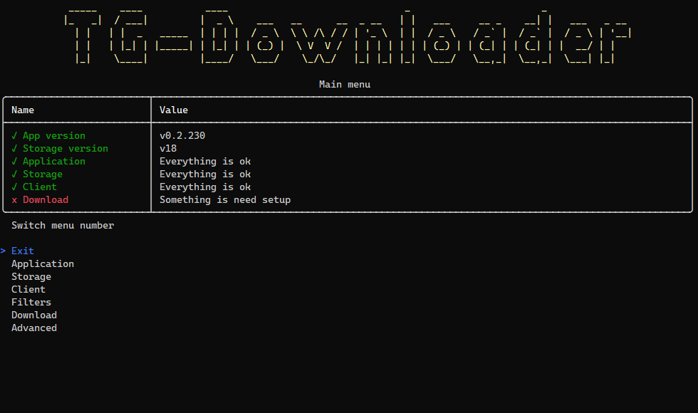
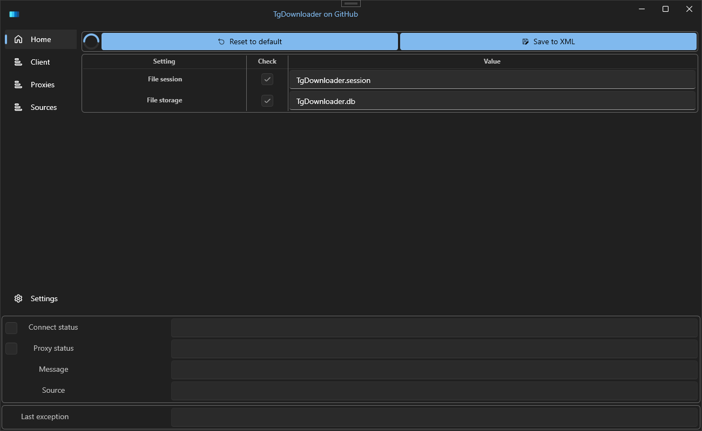

# TgDownloader - Telegram Files Downloader

## 
<b><a href="README.md">Readme</a> | <a href="CHANGELOG.md">Changelog</a> | <a href="RELEASE.md">Releases</a> | <a href="SCREENSHOTS.md">Screenshots</a> | <a href="GUIDES.md">Guides</a> | <a href="LICENSE.md">License</a></b>

## 
<b><a href="README-RUS.md">Прочти меня</a> | <a href="CHANGELOG-RUS.md">История версий</a> | <a href="RELEASE.md">Релизы</a> | <a href="SCREENSHOTS.md">Скриншоты</a> | <a href="GUIDES-RUS.md">Руководства</a> | <a href="LICENSE.md">Лицензия</a></b>

## 

## 

## Overview
Download files of the Telegram channels or groups you are a member of.

### Broken changes
- Software v0.2.xxx has a new storage format, save the previous file, it will be overwritten

## Install Requirements
- [Install .NET 7.0](https://dotnet.microsoft.com/download/dotnet/7.0)
- [Register Telegram app](https://my.telegram.org/apps/)
- Save the values of the "App api_id" and "App api_hash" fields

## Status

## Support
Please click the `star` button if this tool was helpful to you.

## Quick links
- [Report a bug](https://github.com/DamianMorozov/TgDownloader/issues)
- [Discussions](https://github.com/DamianMorozov/TgDownloader/discussions)
- [Ideas](https://github.com/DamianMorozov/TgDownloader/discussions/categories/ideas)
- [TgDownloader News](https://t.me/TgDownloader)
- [TgDownloader Chat Global](https://t.me/TgDownloaderChat)
